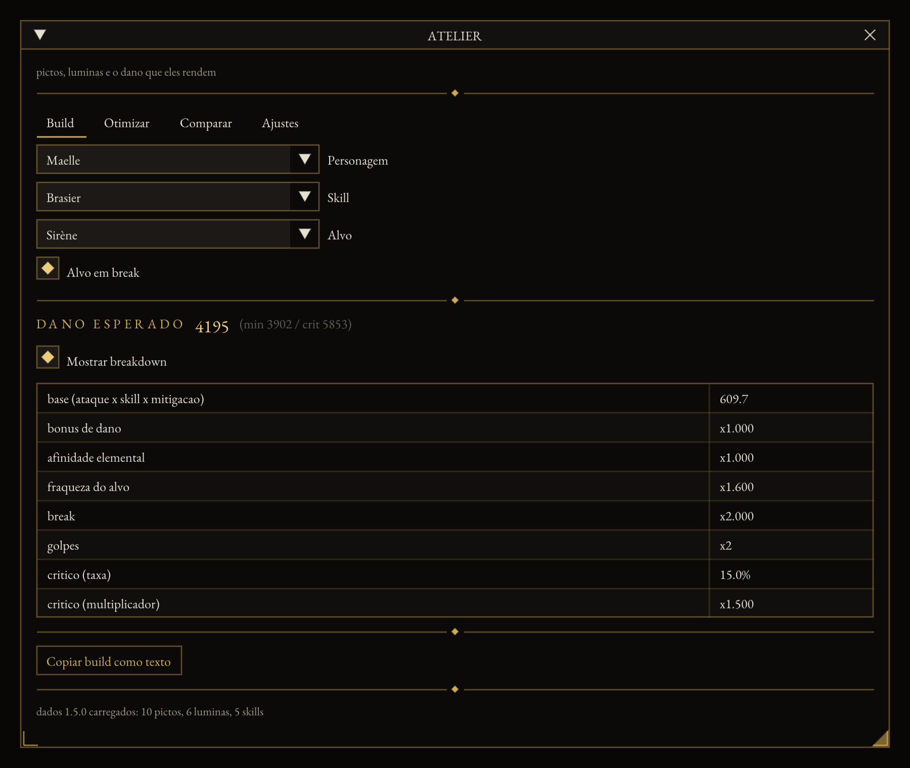

# E33 Picto Optimizer

In-game overlay for **Clair Obscur: Expedition 33**: reads your live build and
searches for a better picto and lumina combination. Self-loading C++ mod with a draggable
ImGui window. No mod loader required.



> **Status: pre-alpha.** Not distributable yet — see the note under
> Installation. What it cannot do yet is
> read your actual build: the memory reads (M0/M3) need the game running. The
> damage coefficients are also uncalibrated (M4). The formula, the search, the
> comparison and the overlay are built and tested.

## Why an overlay and not an external window

Tools like Mobalytics are external always-on-top windows because League and TFT
have anti-cheat and forbid injection. E33 is single-player with no anti-cheat
and a mature modding platform, so the overlay reads game state **directly from
memory, live** — no save parsing, no OCR. It also works in exclusive fullscreen,
and ImGui provides dragging, resizing, collapsing and persisted position.

## What is honest about the numbers

The damage formula's **coefficients are not calibrated against measured damage
yet**. The shape of the formula is implemented and tested; the constants are a
plausible starting point. `tests/fixtures/` holds the harness that closes M4:
drop in measurements taken in game, and the suite fails if the mean error
exceeds 2%. Until then the settings tab says so in the UI, and no accuracy
figure is published here.

The optimizer distinguishes **proven optimal** from **best found**: an
exhaustive branch-and-bound proves optimality, while large inventories fall
back to beam search or stop at a node ceiling. The results panel labels which
one you are looking at.

## Installation

No UE4SS needed — this mod loads itself. Grab `Atelier33.zip` from
[Releases](../../releases), or from the artifacts of the latest
[CI run](../../actions).

1. In Steam: right-click the game → Manage → **Browse local files**, then open
   `Sandfall\Binaries\Win64\`. That folder holds the game executable.
2. Extract the whole zip **into that folder**. You end up with:

   ```
   Win64\
   ├── version.dll          <- next to the executable, on purpose
   └── Atelier33\
       ├── data\
       ├── assets\
       └── config.json
   ```

3. Start the game and press **F8**. The damage coefficients are not calibrated yet — see above.

`version.dll` is a proxy: Windows loads it instead of the system copy, and every call
is passed straight through. The two mods in this pair use different proxy names
(version.dll here), so they can sit in the same folder. If you would rather not
replace a system DLL name, any DLL injector loads the same file unchanged.

To uninstall, delete `version.dll` and the `Atelier33` folder.

## Building

Every dependency is public, so the DLL builds with no account, token or private
checkout — that was not true of the UE4SS route, see
[docs/BUILD-BLOCKER.md](docs/BUILD-BLOCKER.md):

```sh
cmake -B build -G Ninja -DCMAKE_BUILD_TYPE=Release   # Windows/MSVC
cmake --build build
cmake --build build --target package                 # the installable zip
```

Before pushing Windows code from a Mac or Linux box, syntax-check it without
waiting on CI:

```sh
brew install mingw-w64       # or: apt install g++-mingw-w64-x86-64
./tools/check-windows.sh
```

Everything else builds anywhere, which is how the project is developed
off-Windows:

```sh
xmake f -y                                # nlohmann_json, doctest, imgui, glfw
xmake build tests   && xmake run tests    # logic suite, no game needed
xmake build bench   && xmake run bench    # search timing against the 3s budget
xmake build harness && xmake run harness  # the overlay in a native window
```

The harness draws the same overlay the mod draws in-game, with a hand-editable
party in place of memory reads. Its fixtures are in `harness/sample/` and are
deliberately separate from `data/` — those ids are invented.

## Data extraction

```sh
pnpm install
pnpm extract --dump /path/to/FModel/Output/Exports --version 1.5.0
pnpm test        # the extractor's own suite
```

Column names live in `tools/tables.json`, so a patch that renames one is a data
edit, not a code change. The extractor fails loudly on a missing required
column, an empty table, or more than a tenth of a table being rejected.

## Roadmap

| Milestone | State |
|---|---|
| M0 — Lua prototype: read an equipped picto | needs the game |
| M1 — draggable overlay with configurable hotkey | done (in the harness; in-game ImGui registration unverified) |
| M2 — FModel dump to validated JSON | done |
| M3 — live party, pictos, luminas, weapon, stats | interface and mock done; memory reads need the game |
| M4 — damage formula with breakdown, <2% mean error | formula and harness done; calibration needs the game |
| M5 — dominance pruning, branch and bound, beam, off-thread | done |
| M6 — compare panel, compact mode, export build text | done |

## Layers

`Calc/` and `Optimizer/` know nothing about ImGui. `UI/` knows nothing about
Unreal object pointers. When a patch breaks the mod, the damage is in `Game/`.
That split is what lets the entire logic layer build and run on macOS and in CI.

See [docs/DEV-MACOS.md](docs/DEV-MACOS.md) for what runs where.

## Interface

The palette comes from the game's own material library — obsidian, black
marble, gold — with gold used only as rule, border and highlight, mitred
corners, letterspaced capitals and diamond fleurons. Text is EB Garamond, a
French old-style shipped under the OFL: the game's own face is third-party and
cannot be redistributed in a mod.

The screenshot above is generated, not hand-taken:

```sh
xmake run harness --shot shot.bmp --frames 40 --demo
```

## License

MIT — see [LICENSE](LICENSE). Bundled font under the SIL OFL 1.1, see
[assets/fonts/](assets/fonts/).
